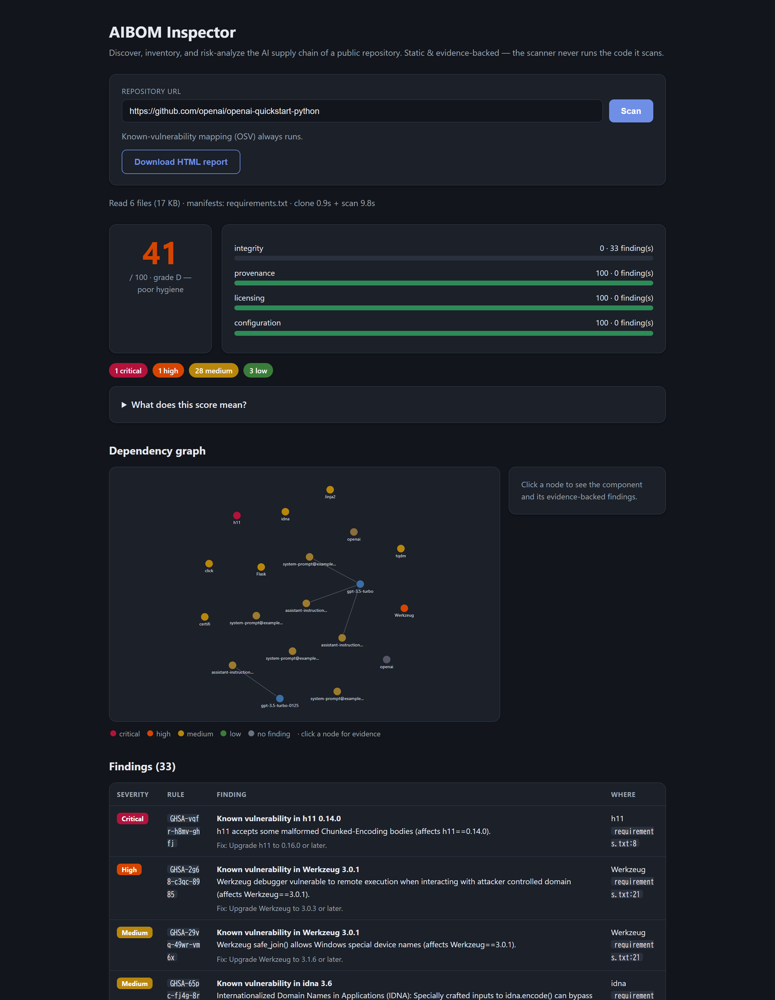

# AIBOM Inspector

> **Discover, inventory, and analyze AI supply chains — the "Dependency-Track for AI."**
> Static, evidence-backed, local-first. **Never executes scanned code or loads scanned models.**

[](https://github.com/d01ki/AIBOM-Inspector/actions/workflows/ci.yml)
[](LICENSE)
[](https://www.python.org/)

`aibom` scans a repository and produces an **evidence-backed inventory** of the AI
components it depends on — models, datasets, prompts, agents, and external AI
services — as a first step toward a full **AIBOM** (AI Bill of Materials) and
supply-chain risk analysis.

Every entity it reports is pinned to a concrete `file:line` with the pattern that
matched. **No evidence, no claim** — that is the trust contract of the tool.

## Demo

`docker compose up`, open <http://localhost:8000>, paste a repository URL, press
**Scan** — security score, interactive dependency graph, and evidence-backed
findings (here: `openai/openai-quickstart-python`):



Shareable scan links work too: `http://localhost:8000/?repo=https://github.com/owner/repo`
pre-fills the form and starts the scan on load.

---

## Why

Existing SBOM tooling (Trivy, Syft) is package-level and blind to models,
datasets, prompts, and agents. AIBOM generators produce a bill of materials for a
*single* known model. **AIBOM Inspector discovers AI usage across a whole codebase**,
resolves it, and adds graph + risk analysis on top.

| Tool | Gap AIBOM Inspector fills |
|---|---|
| OWASP AIBOM Generator | Generates an AIBOM for a single HF model. AIBOM Inspector *discovers* AI usage across a codebase and adds graph + risk analysis. |
| Trivy / Syft (SBOM) | Package-level only; blind to models, datasets, prompts, agents. |
| Dependency-Track | Consumes SBOMs; no AI-specific discovery or risk rules. |
| `modelscan` / `picklescan` | Scan a *given* model file for unsafe pickles. AIBOM Inspector *finds which models a repo uses in the first place*, then flags the pickle risk in context. |

## Features

- **Discovery** — Python AST detectors for OpenAI, Anthropic, and Hugging Face
  usage (import aliases, real API invocations, auditable value resolution),
  plus JS/TS AI usage, MCP clients/servers, notebooks, prompts, datasets, and
  LangChain/LangGraph agents
- **Evidence & reachability** — declared/imported/instantiated/invoked states,
  same-file entrypoint paths, confidence factors, stable detector IDs, and
  production/test/example/docs source contexts
- **Prompt source-to-sink analysis** — bounded data-flow paths from HTTP / CLI
  / environment / file / retrieval / database inputs into OpenAI & Anthropic
  prompt sinks, with trust boundaries and secret-safe prompt hashes
- **Complete dependency BOM** — every package in `requirements*.txt`,
  `pyproject.toml`, `Pipfile`, `package.json` (PyPI + npm) with versions and
  purls; the AI/ML layer is flagged and drives the risk analysis
- **Hugging Face resolver** — license, model card, serialization formats,
  author, downloads, gated status (network-optional, cache-backed,
  offline-friendly; **never downloads or loads weights**)
- **Vulnerability mapping** — with `--resolve`, pinned packages are checked
  against [OSV.dev](https://osv.dev); matching CVE/GHSA advisories become
  evidence-backed findings
- **Deterministic risk rules** (TDR-001…012, AIBOM-PROMPT-004) + a reproducible
  0–100 security score over integrity / provenance / licensing / configuration
- **Standard outputs** — CycloneDX 1.6 ML-BOM (validated against the official
  schema), SARIF 2.1.0 for GitHub Code Scanning, JSON inventory, self-contained
  HTML report, severity-gated exit codes for CI
- **Web app** — FastAPI backend (`aibom serve`) + single-page UI with an
  interactive risk-colored dependency graph
- **Reproducible benchmark harness** — category precision/recall/F1 with
  explicit false-positive and false-negative reports

Design & roadmap → [SPEC.md](SPEC.md).

## Quick start (Docker — recommended)

Clone and start; no Python environment needed, identical everywhere:

```bash
git clone https://github.com/d01ki/AIBOM-Inspector
cd AIBOM-Inspector
docker compose up
```

Then open **<http://localhost:8000>** in your browser — that's the whole UI + API.

- Run in the background with `docker compose up -d`; stop with `docker compose down`.
- **Port 8000 already in use?** Start on another port, e.g.
  `AIBOM_PORT=8765 docker compose up`, then open `http://localhost:8765`.
- **Running on a remote server / VM?** It listens on all interfaces — reach it at
  `http://<server-ip>:8000` (verify locally with `curl http://localhost:8000/api/health`).

### CLI via Docker

```bash
docker build -t aibom-inspector .

# guided menu: 1) scan a URL  2) scan a directory  3) demo  4) web UI
docker run --rm -it aibom-inspector aibom

# demo scan — zero setup, offline, shows every rule firing
docker run --rm aibom-inspector aibom scan --demo

# scan a public repo by URL — no mounts needed (shallow-cloned in the container)
docker run --rm aibom-inspector aibom scan https://github.com/openai/openai-quickstart-python

# scan a local repo (mount it read-only); keep outputs via a second mount
docker run --rm -v "/abs/path/to/repo:/scan:ro" -v "$PWD/out:/out" \
  aibom-inspector aibom scan /scan --report /out/report.html --sarif /out/findings.sarif
```

For local scans, swap the left side of `-v` for the **absolute path of your own
repo**. If the scan reports `Read 0 files`, the mounted path was wrong or
empty — Docker silently creates an empty directory for a host path that does
not exist.

## Install without Docker

Not yet on PyPI — install from source into a virtual environment
(Debian/Ubuntu's system Python rejects bare `pip install`, per PEP 668):

```bash
git clone https://github.com/d01ki/AIBOM-Inspector
cd AIBOM-Inspector
python3 -m venv .venv && . .venv/bin/activate
pip install -e ".[dev]"    # or, with uv: uv venv && uv pip install -e ".[dev]"
```

Or without cloning, via pipx: `pipx install "git+https://github.com/d01ki/AIBOM-Inspector"`.

## Usage

New here? Just run `aibom` — a guided menu walks you through everything:

```text
AIBOM Inspector - AI supply-chain scanner (static, evidence-backed)

  1) Scan a public repository URL
  2) Scan a local directory
  3) Demo - scan the bundled vulnerable AI app (offline)
  4) Start the web UI in your browser
  q) Quit
```

Direct commands for scripts and CI:

```bash
aibom scan .                                # local directory
aibom scan https://github.com/owner/repo    # public repo (shallow clone, cleaned up)
aibom scan --demo                           # bundled deliberately-vulnerable demo

# outputs: JSON inventory / CycloneDX 1.6 ML-BOM / SARIF / self-contained HTML
aibom scan . -o inv.json -c aibom.cdx.json --sarif findings.sarif -r report.html

# online enrichment (HF metadata + OSV vulnerabilities) and a CI severity gate
aibom scan . --resolve --fail-on high

aibom scan --help   # everything else: confidence filter, detector/rule control, HF cache
```

### Configuration (organization policy as code)

Scan defaults are read from `aibom.toml` at the target root, or from
`[tool.aibom]` in the target's `pyproject.toml`. Explicit CLI flags always
override the config; `--no-config` ignores it entirely. Unknown keys are
rejected loudly so a typo can't silently weaken the policy.

```toml
# aibom.toml — committed next to the code, one policy for every pipeline
fail_on = "high"
min_confidence = 0.6
disable_detectors = ["python.openai.ast"]
ignore_rules = ["TDR-004", "OSV-*"]     # exact IDs or 'PREFIX-*' families
```

Suppressed rules are excluded from the findings, the security score, and the
`--fail-on` gate. The web API never applies a scanned repository's own config —
a third-party repo can't silence its own findings.

### GitHub Code Scanning

```yaml
- run: |
    pip install "git+https://github.com/d01ki/AIBOM-Inspector"
    aibom scan . --sarif findings.sarif
- uses: github/codeql-action/upload-sarif@v3
  with: { sarif_file: findings.sarif }
```

## Risk rules & scoring

Findings are **deterministic and rule-based** (no LLM in the loop). Each carries a
severity, a `file:line` evidence trail, and a remediation.

| ID | Check | Default severity | Needs `--resolve` |
|---|---|---|---|
| TDR-001 | Pickle-based weight format (arbitrary code exec on load) | High | — |
| TDR-002 | Model reference without a pinned revision | Medium | — |
| TDR-003 | Name impersonates a popular model family (typosquat) | High | — |
| TDR-004 | Missing model card | Low | ✔ |
| TDR-005 | License missing / non-SPDX / unrecognized | Medium–Low | ✔ |
| TDR-006 | Very low adoption (verify author) | Medium | ✔ |
| TDR-007 | Hardcoded secret near an AI call | Critical | — |
| TDR-008 | Dataset with no provenance metadata | Low | — |
| TDR-009 | `trust_remote_code=True` | High | — |
| TDR-010 | Deprecated / superseded model referenced | Medium | — |
| TDR-011 | MCP server exposes an LLM-invokable tool surface | Low | — |
| TDR-012 | AI package declared without a pinned version | Low | — |
| AIBOM-PROMPT-004 | Untrusted input flows into system/developer instructions | High | — |
| OSV-* | Known vulnerability in a pinned AI package (OSV.dev) | per advisory | ✔ (network) |

**Security score (0–100):** each of the four categories {integrity, provenance,
licensing, configuration} starts at 100 and loses points per finding
(critical 40 / high 20 / medium 10 / low 3, floored at 0, counting at most
3 findings per rule). The overall score is `0.55 × mean + 0.45 × worst category`,
so one wrecked category cannot be averaged away by categories with no components.
An empty inventory renders as "no AI components detected", not as 100/A. The
formula is printed in the report itself for reproducibility.

Try it against the bundled deliberately-vulnerable demo app:

```bash
aibom scan tests/fixtures/vulnerable-ai-app
```

## Web app

Paste a repo URL in the browser, get the AIBOM + score. `docker compose up`
(Quick start above) is the easiest way to run it; without Docker:

```bash
pip install -e ".[server]"         # in the venv from "Install without Docker"
aibom serve                        # then open http://localhost:8000
```

The backend shallow-clones the URL into a throwaway temp dir, runs the same
static pipeline as the CLI, and returns JSON — it **never executes the cloned
code**. Clone URLs are validated against a host allowlist (github.com,
gitlab.com, bitbucket.org, codeberg.org) and passed to git as argv, not a shell
string.

| Endpoint | Purpose |
|---|---|
| `POST /api/scan` `{repo_url, resolve?}` | Inventory + CycloneDX + findings + score + dependency graph (JSON) |
| `POST /api/report` `{repo_url, resolve?}` | Self-contained HTML report |
| `GET /api/health` | Liveness + version |

The UI renders an interactive dependency graph from `/api/scan`'s `graph`
(`{nodes, edges}`): nodes are colored by their worst finding severity; click one
to see the component and its evidence trail.

## What it detects

| Component | Signals |
|---|---|
| **Models** | Python AST-confirmed OpenAI/Anthropic calls, `from_pretrained(...)`, `pipeline(model=...)`, variables/dictionaries/f-strings/environment defaults, `repo_id=`, HF URLs, and weight files (`.safetensors`, `.gguf`, `.pkl`, `.bin`, …) |
| **Datasets** | `load_dataset(...)` |
| **Prompts** | template files, hardcoded system prompts, OpenAI Responses/Chat/Completions/Assistants and Anthropic Messages/Completions sinks, with bounded source-to-sink paths for HTTP, CLI, environment, file, retrieval, and database inputs |
| **Agents** | LangChain/LangGraph constructors (`create_react_agent`, `AgentExecutor`, …) |
| **Services** | provider SDK imports in Python **and JS/TS** (`openai`, `anthropic`, `@anthropic-ai/sdk`, …), explicit `base_url`, MCP client configs (`mcpServers`), **MCP server implementations** (Python `mcp`/`FastMCP`, TS `@modelcontextprotocol/sdk`) |
| **Packages** | **every** dependency declared in `requirements*.txt`, `pyproject.toml`, `Pipfile`, `package.json` (PyPI + npm), with version + purl — a complete BOM. AI/ML-ecosystem packages (incl. `mcp`/`fastmcp`/`@modelcontextprotocol/*`) are flagged `ai`, and that AI layer is what the risk rules, graph, and score focus on |

## Design principles

- **Static only.** The scanner reads text. It never imports, executes, or unpickles anything.
- **Evidence-backed.** Every entity carries `file:line` + the matched pattern + a confidence.
- **Deterministic.** Detection and (planned) scoring are rule-based and reproducible; LLM assistance is opt-in and limited to *explaining* findings, never producing them.
- **Local-first.** No SaaS, no telemetry, air-gap friendly.

## Development

```bash
uv run pytest            # tests
uv run ruff check .      # lint
uv run mypy              # types
python benchmark/evaluate.py  # precision/recall benchmark
```

The benchmark covers a deterministic local fixture plus a
[pinned public evaluation](benchmark/reports/external-latest.md) — regression
evidence, not a claim of broad ecosystem coverage.

Implementation details: [architecture](docs/architecture.md),
[detection methodology](docs/detection-methodology.md),
[benchmark methodology](docs/benchmark-methodology.md), and
[known limitations](docs/limitations.md).

### Releasing

Publishing is automated via [PyPI Trusted Publishing](https://docs.pypi.org/trusted-publishers/)
(OIDC — no tokens). One-time: add a trusted publisher on PyPI for this repo,
workflow `release.yml`, environment `pypi`. Then push a tag:

```bash
git tag v0.1.0 && git push origin v0.1.0   # builds, twine-checks, and publishes
```

## License

Apache-2.0 — see [LICENSE](LICENSE).
