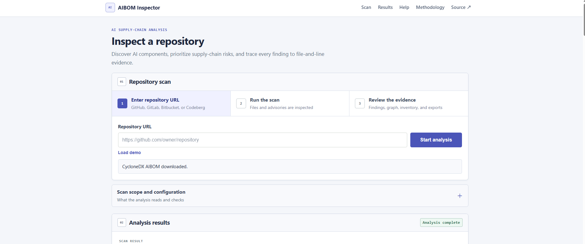

# AIBOM Inspector

> **Discover, inventory, and analyze AI supply chains — the "Dependency-Track for AI."**
> Static, evidence-backed, local-first. **Never executes scanned code or loads scanned models.**

[](https://github.com/d01ki/AIBOM-Inspector/actions/workflows/ci.yml)
[](LICENSE)
[](https://www.python.org/)

`aibom` scans a repository and produces an **evidence-backed inventory** of the AI
components it depends on — models, datasets, prompts, agents, and external AI
services — as a first step toward a full **AIBOM** (AI Bill of Materials) and
supply-chain risk analysis.

Every entity it reports is pinned to a concrete `file:line` with the pattern that
matched. **No evidence, no claim** — that is the trust contract of the tool.

The differentiator is a **behavioral AIBOM** with **Agent Capability
Blast-Radius Drift**. It connects a bounded chain of evidence:
untrusted input → privileged instructions → model → directly bound tool →
tool-parameter-controlled operation. It can show that a revision newly enables
command execution, file mutation, or external actions even when the model,
tool, SDK, packages, and ordinary component BOM are unchanged. Prompt bodies
and tool argument values are never retained.

That analysis runs on **Python and TypeScript/JavaScript alike** — including
the Vercel AI SDK, OpenAI Agents, MCP TypeScript servers, and Next.js/Express
route handlers, where most agent code now lives.

**Two tiers, stated plainly.** Python and JS/TS get syntax-aware behavioral
analysis, because every claim is backed by a parse tree. Go, Java, Rust, Ruby,
C# and PHP get *inventory* coverage — dependencies, model ids, provider SDKs,
prompt constants and secrets — from the pattern layer. Those languages never
produce impact paths or drift verdicts, and the tool does not pretend otherwise.

## Demo

[](https://youtu.be/BPWNt6KgGvY)

Or watch directly: <https://youtu.be/BPWNt6KgGvY>

Hosted instance: <https://aibom-inspector.com/>

## Quick start

Clone, then run one command. The launcher builds the image on first use and
handles every Docker flag for you.

```bash
git clone https://github.com/d01ki/AIBOM-Inspector && cd AIBOM-Inspector
./aibom
```

That opens a guided menu. Or go straight to what you want:

```bash
./aibom demo             # offline blast-radius + drift demo (no URL, no network)
./aibom ui               # web UI at http://localhost:8000
./aibom scan .           # scan this directory
./aibom scan https://github.com/owner/repo
./aibom diff old/ new/   # behavioral drift between two revisions
```

On Windows PowerShell use `.\aibom.ps1` with the same arguments. Local paths are
mounted read-only and rewritten automatically; reports land in `./aibom-out`.

The UI and the CLI run the same pipeline and expose the same capabilities —
scan, behavioral drift, impact paths, and every export. Shareable scan links
work too: `http://localhost:8000/?repo=https://github.com/owner/repo` pre-fills
the form and starts the scan on load.

---

## Why

Existing SBOM tooling (Trivy, Syft) is package-level and blind to models,
datasets, prompts, and agents. Repository-level AIBOM discovery now exists in
several tools, so inventory alone is not the novelty. **AIBOM Inspector adds
code-proven behavioral context**: whether a component is merely declared or
actually invoked/reachable, how external input crosses a prompt trust boundary,
and whether a revision introduced a new exposure while keeping the same parts.

| Tool | Gap AIBOM Inspector fills |
|---|---|
| OWASP AIBOM Generator | Generates an AIBOM for a single HF model. AIBOM Inspector *discovers* AI usage across a codebase and adds graph + risk analysis. |
| Snyk / Cisco AI-BOM | Strong repository discovery and component/workflow graphs. AIBOM Inspector focuses on deterministic role-aware prompt lineage and impact drift without an online service or LLM verdict. |
| Snyk Agent Scan / Agent Audit | Detect prompt injection, toxic capabilities, and tool-boundary taint. AIBOM Inspector does **not** claim those primitives as novel; it connects them to AIBOM identity and flags a newly reachable source→instructions→bound-tool→operation path when the component set is unchanged — and runs that same analysis on TypeScript agent code without installing or executing the project's npm toolchain. |
| AIBOM / agent-bom | Provide broad fleet drift or multi-hop attack paths. AIBOM Inspector targets the narrower case they do not publicly document: a new untrusted-to-privileged prompt flow when the component inventory is identical. |
| Trivy / Syft (SBOM) | Package-level only; blind to models, datasets, prompts, agents. |
| Dependency-Track | Consumes SBOMs; no AI-specific discovery or risk rules. |
| `modelscan` / `picklescan` | Scan a *given* model file for unsafe pickles. AIBOM Inspector *finds which models a repo uses in the first place*, then flags the pickle risk in context. |

The dated, source-linked competitive analysis and claim boundaries are in
[docs/novelty-positioning.md](docs/novelty-positioning.md).

## Features

- **Discovery** — Python AST detectors for OpenAI, Anthropic, and Hugging Face
  usage (import aliases, real API invocations, auditable value resolution),
  plus JS/TS AI usage, MCP clients/servers, notebooks, prompts, datasets, and
  LangChain/LangGraph agents
- **Syntax-aware TypeScript/JavaScript analysis** — the same role-aware prompt
  lineage and blast-radius analysis for the stacks agents are actually written
  in: Vercel AI SDK (`generateText`/`streamText`/`generateObject`), OpenAI
  Agents (`new Agent({ instructions, tools })`), the OpenAI and Anthropic Node
  SDKs, MCP TypeScript servers, Next.js route handlers, and Express. Uses a
  dependency-free tolerant parser — no Node.js, no bundling, no transpiling,
  and the analyzed code is never executed
- **Evidence & reachability** — declared/imported/instantiated/invoked states,
  same-file entrypoint paths, confidence factors, stable detector IDs, and
  production/test/example/docs source contexts. The complete inventory retains
  every context, while findings, score, graph, and behavioral paths default to
  production evidence so deliberately vulnerable fixtures do not score their
  host repository
- **Prompt source-to-sink analysis** — bounded data-flow paths from HTTP / CLI
  / environment / file / retrieval / database inputs into OpenAI & Anthropic
  prompt sinks, with trust boundaries and secret-safe prompt hashes
- **Trust-Boundary Drift** — `aibom diff` detects new privileged-prompt
  exposure, prompt target/content changes, usage escalation, component drift,
  and new findings across revisions; JSON output and severity gates make it
  usable in CI
- **Agent Capability Blast Radius** — for OpenAI Agents SDK constructions,
  correlates untrusted privileged instructions with explicit `tools=[...]`
  bindings and follows model-controlled tool parameters into command execution,
  filesystem mutation, network egress, or external actions. Fixed operations,
  unbound helpers, and undecorated functions are not promoted to impact paths
- **Blast-Radius Drift** — emits a critical `impact_path_added` when the
  component BOM is unchanged but a new trust-boundary path makes a powerful
  bound capability steerable
- **Complete dependency BOM** — every package in `requirements*.txt`,
  `pyproject.toml`, `Pipfile`, `package.json`, `go.mod`, `Cargo.toml`,
  `pom.xml`, `build.gradle`, `Gemfile`, `composer.json` and `*.csproj` with
  versions and purls across **PyPI, npm, Go, crates.io, Maven, RubyGems,
  Packagist and NuGet**; the AI/ML layer is flagged and drives the risk analysis
- **Lockfile resolution** — `package-lock.json`, `Pipfile.lock`, `poetry.lock`,
  `uv.lock`, hash-pinned `requirements*.txt`, `Cargo.lock`, `composer.lock` and
  `Gemfile.lock` add the **transitive** graph, exact versions, the supplying
  registry, and the **artifact digest** of every locked component
- **CISA 2026 SBOM minimum-elements conformance** — the emitted CycloneDX
  targets the [2026 baseline][cisa2026] that replaced the 2021 NTIA elements
  and now explicitly covers AI software: SBOM author, generation context
  (lifecycle phase), primary component, component hashes + algorithms,
  licenses, producers, identifiers, and a dependency entry for every component.
  What static analysis cannot know is **declared** as a known unknown with a
  reason instead of left blank. `aibom conformance <bom.json>` scores any
  CycloneDX SBOM, not only the ones this tool produces —
  [gap analysis](docs/cisa-2026-minimum-elements.md)

[cisa2026]: https://www.cisa.gov/resources-tools/resources/2026-minimum-elements-software-bill-materials-sbom
- **Hugging Face resolver** — license, model card, serialization formats,
  author, downloads, gated status (network-optional, cache-backed,
  offline-friendly; **never downloads or loads weights**)
- **Vulnerability mapping** — with `--resolve`, pinned packages are checked
  against [OSV.dev](https://osv.dev); matching CVE/GHSA advisories become
  evidence-backed findings
- **Deterministic risk rules** (TDR-001…012, AIBOM-PROMPT-004,
  AIBOM-IMPACT-001) + a reproducible
  0–100 security score over integrity / provenance / licensing / configuration
- **Standard outputs** — CycloneDX 1.6 ML-BOM (validated against the official
  schema), SARIF 2.1.0 for GitHub Code Scanning, JSON inventory, self-contained
  HTML report, severity-gated exit codes for CI
- **Web app** — FastAPI backend (`aibom serve`) + single-page UI with an
  interactive risk-colored dependency graph, a revision-comparison panel, and
  the same exports as the CLI (HTML, CycloneDX, SARIF, inventory JSON)
- **Reproducible benchmark harness** — category precision/recall/F1 with
  explicit false-positive and false-negative reports, scored **per language**
  so Python results cannot mask TypeScript ones

Design & roadmap → [SPEC.md](SPEC.md).

## Running it

`./aibom <command>` (or `.\aibom.ps1 <command>`) is the only entry point you
need — it wraps Docker so there are no mounts, ports, or image names to
remember. Every flag of the underlying CLI still works: `./aibom scan . --resolve
--fail-on high -r /out/report.html`.

| Want to… | Command |
|---|---|
| Explore interactively | `./aibom` |
| Run the offline talk demo | `./aibom demo` |
| Use the web UI | `./aibom ui` |
| Scan a directory | `./aibom scan .` |
| Scan a public repo | `./aibom scan https://github.com/owner/repo` |
| Compare two revisions | `./aibom diff baseline/ candidate/` |

Troubleshooting:

- **Port 8000 already in use?** `AIBOM_PORT=8765 ./aibom ui` (PowerShell:
  `$env:AIBOM_PORT=8765; .\aibom.ps1 ui`).
- **`docker_engine` / daemon connection error?** Start Docker Desktop, wait
  until its engine reports ready, then rerun. No extra AIBOM setup is required.
- **Scanning a path outside the current directory?** `cd` to a directory that
  contains it first — only the working directory is mounted, deliberately.
- **Remote server / VM?** `./aibom ui` listens on all interfaces — reach it at
  `http://<server-ip>:8000` (verify with `curl http://localhost:8000/api/health`).

<details>
<summary>Prefer raw Docker Compose?</summary>

```bash
docker compose up                        # UI + API at http://localhost:8000
docker compose run --rm demo             # offline talk demo
docker compose run --rm cli scan /work   # scan the current directory
```

</details>

## Install without Docker

Not yet on PyPI — install from source into a virtual environment
(Debian/Ubuntu's system Python rejects bare `pip install`, per PEP 668):

```bash
git clone https://github.com/d01ki/AIBOM-Inspector
cd AIBOM-Inspector
python3 -m venv .venv && . .venv/bin/activate
pip install -e ".[dev]"    # or, with uv: uv venv && uv pip install -e ".[dev]"
```

Or without cloning, via pipx: `pipx install "git+https://github.com/d01ki/AIBOM-Inspector"`.

## Usage

New here? Just run `aibom` — a guided menu walks you through everything:

```text
AIBOM Inspector - AI supply-chain scanner (static, evidence-backed)

  1) Impact demo - input to agent tool blast radius (offline)
  2) Scan a public repository URL
  3) Scan a local directory
  4) Compare two revisions (behavioral drift)
  5) Start the web UI in your browser
  q) Quit
```

Direct commands for scripts and CI:

```bash
aibom scan .                                # local directory
aibom scan https://github.com/owner/repo    # public repo (shallow clone, cleaned up)
aibom scan --demo                           # bundled deliberately-vulnerable demo
aibom demo                                  # impact + same-components drift (Python and TypeScript)

# outputs: JSON inventory / CycloneDX 1.6 ML-BOM / SARIF / self-contained HTML
aibom scan . -o inv.json -c aibom.cdx.json --sarif findings.sarif -r report.html

# online enrichment (HF metadata + OSV vulnerabilities) and a CI severity gate
aibom scan . --resolve --fail-on high

# CISA 2026 SBOM minimum elements: supply the facts a scanner cannot know,
# write the conformance report, and check any CycloneDX SBOM (including
# someone else's) with a CI gate on silently missing elements
aibom scan . --sbom-author "Acme Security" --sbom-supplier "Acme Inc" \
  --sbom-lifecycle build -c aibom.cdx.json --minimum-elements elements.json
aibom conformance aibom.cdx.json --fail-on-missing

# compare two revisions; fail when a new high-risk behavior appears
aibom diff ./baseline ./candidate --output drift.json --fail-on high

# checked-in demo: identical model/SDK, but the candidate taints a system prompt
aibom diff examples/trust-boundary-drift/baseline \
  examples/trust-boundary-drift/candidate --fail-on high

aibom scan --help   # everything else: confidence filter, detector/rule control, HF cache
```

### Configuration (organization policy as code)

Scan defaults are read from `aibom.toml` at the target root, or from
`[tool.aibom]` in the target's `pyproject.toml`. Explicit CLI flags always
override the config; `--no-config` ignores it entirely. Unknown keys are
rejected loudly so a typo can't silently weaken the policy.

```toml
# aibom.toml — committed next to the code, one policy for every pipeline
fail_on = "high"
min_confidence = 0.6
disable_detectors = ["python.openai.ast"]
ignore_rules = ["TDR-004", "OSV-*"]     # exact IDs or 'PREFIX-*' families
lockfiles = true                        # resolve transitive deps + artifact digests

# CISA 2026 minimum elements about the SBOM document itself
sbom_author = "Acme Security"
sbom_supplier = "Acme Inc"
sbom_lifecycle = "pre-build"            # design|pre-build|build|post-build|operations|…
```

Detector IDs: `python.openai.ast`, `python.anthropic.ast`,
`python.huggingface.ast`, `python.prompt-flow.ast`,
`javascript.prompt-flow.ast`, `python.security-signals.ast`, `legacy.regex`.

Suppressed rules are excluded from the findings, the security score, and the
`--fail-on` gate. The web API never applies a scanned repository's own config —
a third-party repo can't silence its own findings.

### GitHub Code Scanning

```yaml
- run: |
    pip install "git+https://github.com/d01ki/AIBOM-Inspector"
    aibom scan . --sarif findings.sarif
- uses: github/codeql-action/upload-sarif@v3
  with: { sarif_file: findings.sarif }
```

## Risk rules & scoring

Findings are **deterministic and rule-based** (no LLM in the loop). Each carries a
severity, a `file:line` evidence trail, and a remediation.

| ID | Check | Default severity | Needs `--resolve` |
|---|---|---|---|
| TDR-001 | Pickle-based weight format (arbitrary code exec on load) | High | — |
| TDR-002 | Model reference without a pinned revision | Medium | — |
| TDR-003 | Name impersonates a popular model family (typosquat) | High | — |
| TDR-004 | Missing model card | Low | ✔ |
| TDR-005 | License missing / non-SPDX / unrecognized | Medium–Low | ✔ |
| TDR-006 | Very low adoption (verify author) | Medium | ✔ |
| TDR-007 | Hardcoded secret near an AI call | Critical | — |
| TDR-008 | Dataset with no provenance metadata | Low | — |
| TDR-009 | `trust_remote_code=True` | High | — |
| TDR-010 | Deprecated / superseded model referenced | Medium | — |
| TDR-011 | MCP server exposes an LLM-invokable tool surface | Low | — |
| TDR-012 | AI package declared without a pinned version | Low | — |
| AIBOM-PROMPT-004 | Untrusted input flows into system/developer instructions | High | — |
| AIBOM-IMPACT-001 | Untrusted privileged instructions reach a directly bound tool whose model-controlled parameter flows into a high-impact operation | Critical–Medium | — |
| OSV-* | Known vulnerability in a pinned AI package (OSV.dev) | per advisory | ✔ (network) |

**Security score (0–100):** each of the four categories {integrity, provenance,
licensing, configuration} starts at 100 and loses points per finding
(critical 40 / high 20 / medium 10 / low 3, floored at 0, counting at most
3 findings per rule). The overall score is `0.55 × mean + 0.45 × worst category`,
so one wrecked category cannot be averaged away by categories with no components.
An empty inventory renders as "no AI components detected", not as 100/A. The
formula is printed in the report itself for reproducibility.

Run the focused impact and identical-component drift demo:

```bash
aibom demo
```

## Web app

`./aibom ui`, open the printed URL, then click **Run built-in impact demo** or
**Built-in drift demo (TypeScript)**. After that, paste a repository URL for a
normal scan, or two refs to compare revisions. Without Docker:

```bash
pip install -e ".[server]"         # in the venv from "Install without Docker"
aibom serve                        # then open http://localhost:8000
```

The backend shallow-clones the URL into a throwaway temp dir, runs the same
static pipeline as the CLI, and returns JSON — it **never executes the cloned
code**. Clone URLs are validated against a host allowlist (github.com,
gitlab.com, bitbucket.org, codeberg.org) and passed to git as argv, not a shell
string.

| Endpoint | Purpose |
|---|---|
| `POST /api/demo` | Offline built-in impact scan; no URL or network |
| `POST /api/demo/report` | Self-contained report for the built-in demo |
| `POST /api/scan` `{repo_url, resolve?}` | Inventory + CycloneDX + findings + score + dependency graph (JSON) |
| `POST /api/report` `{repo_url, resolve?}` | Self-contained HTML report |
| `POST /api/sarif` `{repo_url, resolve?}` | SARIF 2.1.0, identical to `aibom scan --sarif` |
| `POST /api/demo/sarif` | SARIF for the built-in demo |
| `POST /api/diff` `{repo_url, base_ref, head_ref}` | Behavioral drift between two revisions, plus whether the component inventory is identical |
| `POST /api/diff/demo?language=python\|typescript` | Offline identical-components drift demo |
| `GET /api/health` | Liveness + version |

`/api/diff` pins each side to a branch, tag, or commit SHA with a one-revision
shallow fetch. Refs are validated before they reach git and passed as argv, so a
ref can neither inject a flag nor name a revision range.

The UI renders `impact_paths` and `exposure_paths` above the interactive
dependency graph. Impact paths state the potential consequence first, while
retaining the direct binding, controlled parameter, operation, confidence, and
evidence needed to audit the claim.

API responses include `analysis_scope`: risk and graph claims use
`production`, while test/example/docs entities remain available in the full
inventory and CycloneDX output. To assess a fixture as the target itself, scan
that fixture directory directly (as `aibom demo` does).

## What it detects

| Component | Signals |
|---|---|
| **Models** | Python AST-confirmed OpenAI/Anthropic calls, `from_pretrained(...)`, `pipeline(model=...)`, variables/dictionaries/f-strings/environment defaults, `repo_id=`, HF URLs, and weight files (`.safetensors`, `.gguf`, `.pkl`, `.bin`, …) |
| **Datasets** | `load_dataset(...)` |
| **Prompts** | template files, hardcoded system prompts, OpenAI Responses/Chat/Completions/Assistants, OpenAI Agents SDK instructions, and Anthropic Messages/Completions sinks, with bounded source-to-sink paths for HTTP, CLI, environment, file, retrieval, and database inputs |
| **Agents / capabilities** | LangChain/LangGraph constructors plus OpenAI Agents SDK direct tool bindings; bounded tool-parameter flow into command execution, filesystem writes/deletes, network egress, and external actions |
| **Services** | provider SDK imports in Python **and JS/TS** (`openai`, `anthropic`, `@anthropic-ai/sdk`, …), explicit `base_url`, MCP client configs (`mcpServers`), **MCP server implementations** (Python `mcp`/`FastMCP`, TS `@modelcontextprotocol/sdk`) |
| **TypeScript / JavaScript prompts & tools** | syntax-aware sinks (`generateText`/`streamText`/`generateObject` from `ai`, `new Agent({instructions})` from `@openai/agents`, `chat.completions.create`, `responses.create`, `messages.create`), sources (Next.js `request.json()`, Express `req.body`/`query`/`params`, MCP tool parameters, `process.argv`/`env`, `searchParams`), direct tool bindings (`tools: { name: tool({ execute }) }`, `tools: [boundTool]`), and operations inside them (`child_process`, `fs` writes/deletes, `eval`/`vm`, state-changing `fetch`/`axios`) |
| **Packages** | **every** dependency declared in `requirements*.txt`, `pyproject.toml`, `Pipfile`, `package.json`, `go.mod`, `Cargo.toml`, `pom.xml`, `build.gradle`, `Gemfile`, `composer.json`, `*.csproj` — PyPI, npm, Go, crates.io, Maven, RubyGems, Packagist, NuGet — with version + purl. AI/ML-ecosystem packages are flagged `ai`, and that AI layer is what the risk rules, graph, and score focus on |
| **Other languages** (Go, Java, Kotlin, Rust, Ruby, C#, PHP, Swift, Scala) | pattern-tier only: model ids, provider SDK imports, prompt constants (`static final String SYSTEM_PROMPT = …`, `const SYSTEM_PROMPT: &str = …`, `systemPrompt := …`), MCP configs, secrets. **No** impact paths or drift verdicts — those need a parse tree |

## Design principles

- **Static only.** The scanner reads text. It never imports, executes, or unpickles anything.
- **Evidence-backed.** Every entity carries `file:line` + the matched pattern + a confidence.
- **Deterministic.** Detection and (planned) scoring are rule-based and reproducible; LLM assistance is opt-in and limited to *explaining* findings, never producing them.
- **Local-first.** No SaaS, no telemetry, air-gap friendly.

## Development

```bash
uv run pytest            # tests
uv run ruff check .      # lint
uv run mypy              # types
python benchmark/evaluate.py  # precision/recall benchmark
```

The benchmark covers two deterministic local fixtures (one Python, one
TypeScript) plus a [pinned public evaluation](benchmark/reports/external-latest.md)
over six repositories — two positive and four negative, across both language
front ends.

Current public-corpus result: **precision 1.00** (no false positives anywhere,
including a 163-file pure-JavaScript codebase) and **recall 0.85** — Python
1.00, TypeScript 0.79. The six recall misses are listed in the report rather
than trimmed from the ground truth; they are model ids declared in a data
structure and resolved through an indirection, which the scanner does not
follow yet.

Six repositories is regression evidence, not a claim of broad ecosystem
coverage. The documented target is 20.

Implementation details: [architecture](docs/architecture.md),
[detection methodology](docs/detection-methodology.md),
[benchmark methodology](docs/benchmark-methodology.md), and
[known limitations](docs/limitations.md).

### Releasing

Publishing is automated via [PyPI Trusted Publishing](https://docs.pypi.org/trusted-publishers/)
(OIDC — no tokens). One-time: add a trusted publisher on PyPI for this repo,
workflow `release.yml`, environment `pypi`. Then push a tag:

```bash
git tag v0.1.0 && git push origin v0.1.0   # builds, twine-checks, and publishes
```

## License

Apache-2.0 — see [LICENSE](LICENSE).
